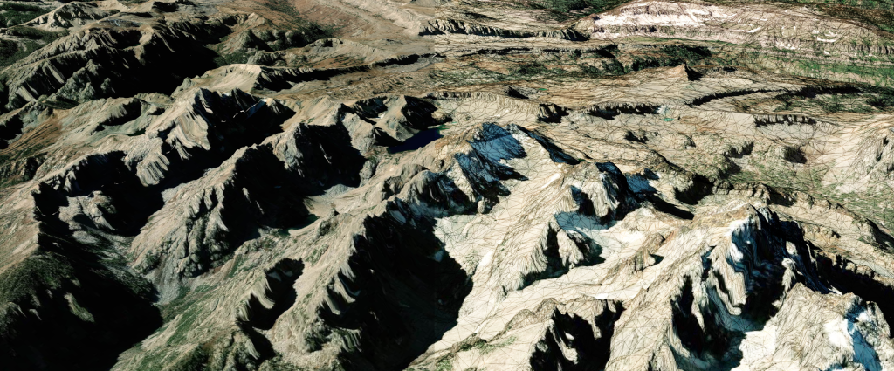

# harp.gl Terrain Datasource 

[](https://travis-ci.com/heremaps/harp-terrain-datasource)

The `harp.gl` Terrain Datasource is a module of [harp.gl](https://github.com/heremaps/harp.gl) to render terrain data encoded using [Quantized Mesh](https://github.com/AnalyticalGraphicsInc/quantized-mesh) or [Mapzen Terrarium](https://mapzen.com/documentation/terrain-tiles/formats/#terrarium).

The image below contains terrain with partially overlaid wireframe.



## About This Repository

This repository is organized in a `yarn workspace`.

## Installation

### In Node.js

The module is installable via yarn (or npm):

```sh
yarn add @here/harp-terrain-datasource
```

```sh
npm install @here/harp-terrain-datasource
```

## Development

### Prerequisites

-   **Node.js** - Please see [nodejs.org](https://nodejs.org/) for installation instructions
-   **Yarn** - Please see [yarnpkg.com](https://yarnpkg.com/en/) for installation instructions.

### Download dependencies

Run:

```sh
yarn install
```

to download and install all required packages and set up the yarn workspace.

### Example Application

The [./example](./example) folder contains source code of [the demo application](https://heremaps.github.io/harp-terrain-datasource/) of harp.gl with Terrain Datasource. See [example's README](./example/README.md).

If you want to learn more about the applications you can create, please check the [Getting Started Guide](docs/GettingStartedGuide.md).

### See Also

* [API Reference](docs/APIReference.md). Introduction to our API.

* [harp.gl](https://github.com/heremaps/harp.gl). 3D map rendering engine based on three.js.

* [TIN Terrain](https://github.com/heremaps/tin-terrain). CLI tool to generate quantized mesh and OBJ tiles out of raster data.

* [Quantized Mesh Viewer](https://github.com/heremaps/quantized-mesh-viewer). Tool for debuging quantized mesh tiles.

* [Quantized Mesh Decoder](https://github.com/heremaps/quantized-mesh-decoder). JavaScript implementation of quantized mesh format decoding.

## License

Copyright © 2017-2020 HERE Europe B.V.

See the [LICENSE](./LICENSE) file in the root of this project for license details about using `harp-terrain-datasource`.

For other use cases not listed in the license terms, please [contact us](https://developer.here.com/contact-us).
